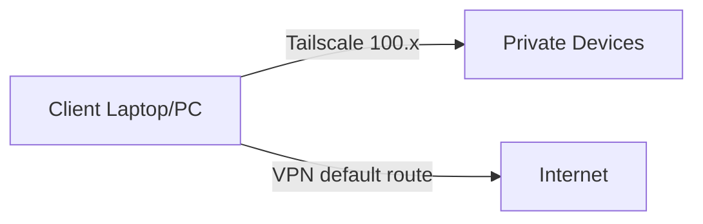

# Tailscale + VPN Coexistence Playbook (v2)

A **copy‑paste‑ready** reference repo showing how to run **Tailscale alongside a traditional VPN** on **Linux, macOS, and Windows**.

It covers **three architecture levels** (from “just works” to advanced NAT traversal), includes **Mermaid diagrams**, **automation scripts** (Bash + PowerShell), **Docker Compose**, **Kubernetes manifests**, and a **security hardening checklist**.

---

## What you get

- ✅ **Level 1:** Side‑by‑side Tailscale + VPN (recommended)
- ✅ **Level 2:** Tailscale Exit Node (VPN replacement)
- ✅ **Level 3:** VPN inside Tailscale (advanced)

Plus:
- ✅ Linux/macOS Bash scripts
- ✅ Windows PowerShell scripts
- ✅ Docker Compose Exit Node
- ✅ Kubernetes Exit Node + Subnet Router
- ✅ `install.sh` + `Makefile` one‑command launcher
- ✅ Security hardening checklist

---

## Quick start

### 1) Clone / unzip

```bash
# If you unzip this repo locally:
cd tailscale-vpn-playbook
```

### 2) Choose a level (interactive)

```bash
./install.sh
```

Or run directly:

```bash
make level1   # side-by-side
make level2   # exit node
make level3   # vpn over tailscale
```

---

## Architecture diagrams

### Level 1 — Side‑by‑side (recommended)



### Level 2 — Exit Node


### Level 3 — VPN inside Tailscale

```mermaid
graph LR
  A[Client] -->|Tailscale| V[VPN Server (behind NAT)]
  V --> S[Private Subnet]
```

---

## Repository layout

```text
.
├── README.md
├── docs/
│   ├── 01-concepts.md
│   ├── 02-decision-tree.md
│   ├── 03-architectures.md
│   ├── 04-linux.md
│   ├── 05-macos.md
│   ├── 06-windows.md
│   ├── 07-docker.md
│   ├── 08-kubernetes.md
│   ├── 09-security-hardening.md
│   └── 10-why-this-works.md
├── scripts/
│   ├── linux/
│   │   ├── level1-side-by-side.sh
│   │   ├── level2-exit-node.sh
│   │   └── level3-vpn-over-tailscale.sh
│   └── windows/
│       ├── level1-side-by-side.ps1
│       ├── level2-exit-node.ps1
│       └── level3-vpn-over-tailscale.ps1
├── docker/
│   ├── docker-compose.yml
│   └── README.md
├── k8s/
│   ├── README.md
│   ├── tailscale-exit-node.yaml
│   └── tailscale-subnet-router.yaml
├── Makefile
├── install.sh
└── LICENSE
```

---

## License
MIT


### Windows interactive launcher

```powershell
.\install.ps1
```


## More docs
- Variables: `docs/00-variables.md`
- Troubleshooting: `docs/11-troubleshooting-playbook.md`
- Threat model: `docs/12-threat-model.md`
- Changelog: `CHANGELOG.md`
