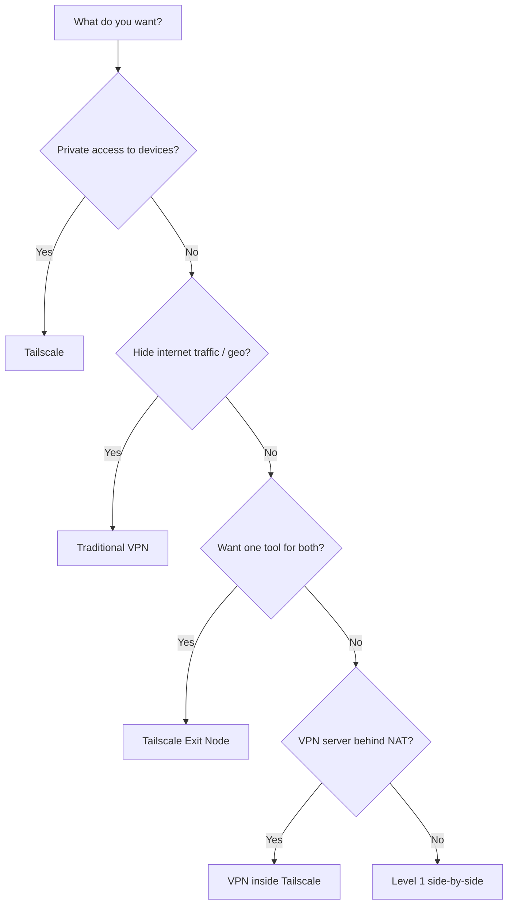

# Decision Tree — What Should I Use?

Use this page when you’re not sure which level you need.

## Practical mapping

- **Level 1** if you use a commercial VPN or already have a VPN endpoint
- **Level 2** if you control a VPS/home server and want one consistent “VPN”
- **Level 3** if your VPN server is behind NAT or you need a hub‑and‑spoke inside a mesh
