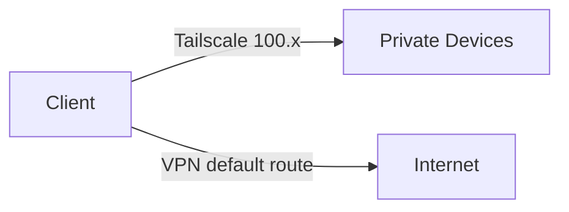

# Architectures (3 Levels)

## Level 1 — Side‑by‑side (Recommended)

- Tailscale for private access (100.x)
- VPN for internet

### Key settings
- Keep VPN as default route (`0.0.0.0/0`)
- Keep Tailscale from overriding DNS unless you want MagicDNS:
  - `tailscale up --accept-dns=false`

---

## Level 2 — Tailscale Exit Node (VPN replacement)

### Key settings
- Exit node advertises exit routing
- Client selects exit node

---

## Level 3 — VPN inside Tailscale (Advanced)

### Key settings
- VPN binds to tailscale interface/IP
- Tailscale handles reachability + identity
